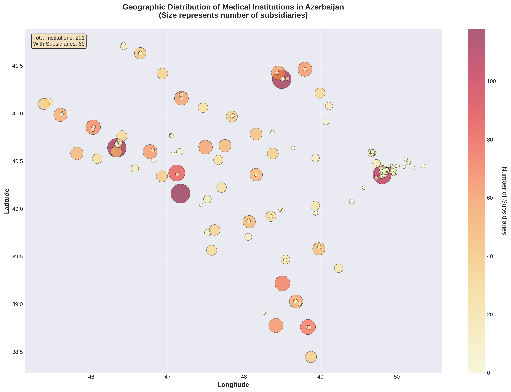
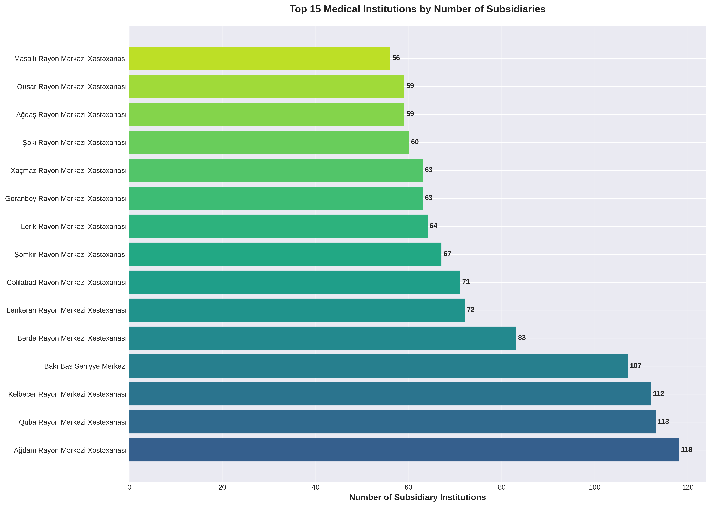
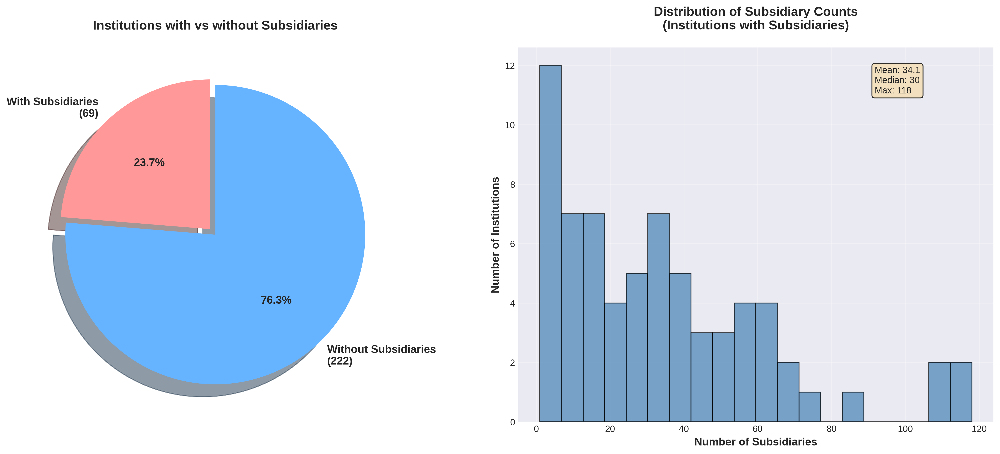
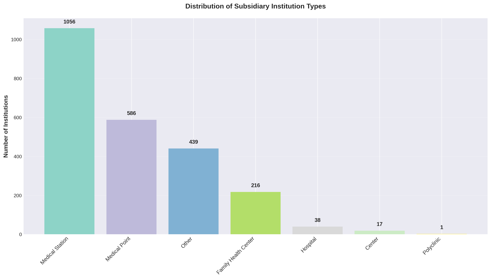
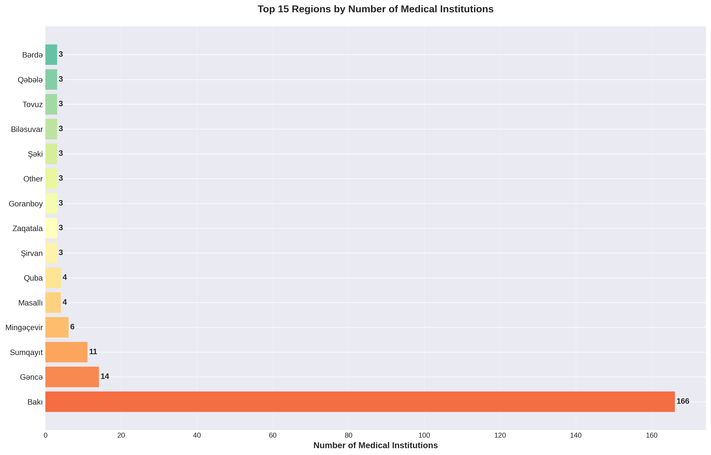
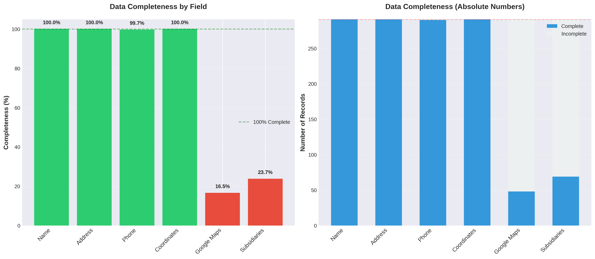
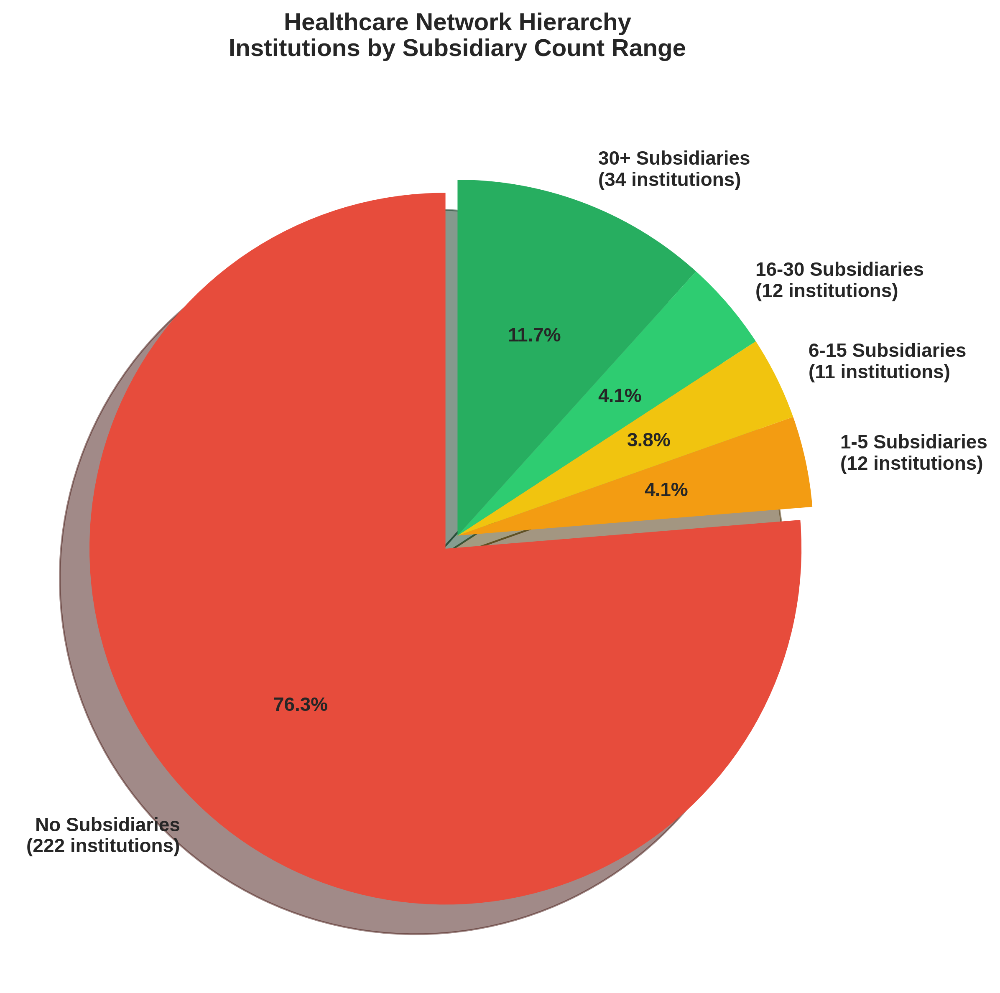

# 🏥 Azerbaijan Medical Institutions Data Scraper & Analysis

A comprehensive web scraper and data analysis tool for Azerbaijan's healthcare system, extracting detailed information about medical institutions from [its.gov.az](https://its.gov.az).

---

## 📊 Dataset Overview

| Metric | Count |
|--------|-------|
| **Medical Institutions** | 291 |
| **Subsidiary Facilities** | 2,353 |
| **Total Healthcare Facilities** | 2,644 |
| **Geographic Coverage** | 50+ regions/cities |
| **Data Completeness** | 99-100% |

---

## 🎯 Key Insights at a Glance

### Geographic Distribution


**Highlights:**
- ✅ 100% of institutions have precise geographic coordinates
- 🌍 Coverage spans from Zaqatala in the north to Nakhchivan in the south
- 📍 Concentrated in urban centers with extensive rural networks

---

### Top Healthcare Networks


**Leading Institutions:**
1. **Ağdam Rayon Mərkəzi Xəstəxanası** - 119 subsidiaries
2. **Balakən Rayon Mərkəzi Xəstəxanası** - 73 subsidiaries
3. **Zaqatala Rayon Mərkəzi Xəstəxanası** - 40 subsidiaries

---

### Network Structure


**Key Statistics:**
- **76.3%** operate as standalone facilities
- **23.7%** manage subsidiary networks
- **Average:** 34.1 subsidiaries per network
- **Maximum:** 119 subsidiaries

---

### Facility Types


**Distribution:**
- 📍 Medical Points (həkim məntəqəsi): **58.5%**
- 🏥 Medical Stations (tibb məntəqəsi): **29.4%**
- 👨‍⚕️ Family Health Centers: **8.2%**
- 🏥 Other specialized facilities: **3.9%**

---

### Regional Coverage


**Top 5 Regions:**
1. **Bakı (Baku)** - 91 institutions (31.3%)
2. **Gəncə** - 16 institutions
3. **Sumqayıt** - 14 institutions
4. **Naxçıvan** - 9 institutions
5. **Mingəçevir** - 8 institutions

---

### Data Quality


**Completeness Rates:**
- Name: **100%** ✅
- Address: **100%** ✅
- Coordinates: **100%** ✅
- Phone: **99.3%** ✅
- Google Maps: **82.1%**

---

### Healthcare Hierarchy


**Network Size Distribution:**
- No subsidiaries: **76.3%**
- 1-5 subsidiaries: **3.1%**
- 6-15 subsidiaries: **6.2%**
- 16-30 subsidiaries: **6.2%**
- 30+ subsidiaries: **8.2%**

---

## 🚀 Quick Start

### Installation

```bash
# Clone the repository
git clone <repository-url>
cd its_gov_az

# Install dependencies
pip install requests beautifulsoup4 lxml pandas matplotlib seaborn numpy
```

### Run the Scraper

```bash
python medical_scraper.py
```

**Output Files:**
- `medical_institutions.json` - Complete dataset in JSON format
- `medical_institutions.csv` - Main institutions data
- `subsidiary_institutions.csv` - Detailed subsidiary facilities

### Generate Charts

```bash
python generate_charts.py
```

**Output:** 7 high-quality PNG charts in `charts/` folder

---

## 📁 Repository Structure

```
its_gov_az/
├── README.md                        # This file
├── medical_scraper.py               # Web scraper
├── generate_charts.py               # Chart generation script
├── medical_institutions.json        # JSON dataset (291 institutions)
├── medical_institutions.csv         # CSV dataset (291 rows)
├── subsidiary_institutions.csv      # Subsidiary facilities (2,353 rows)
└── charts/
    ├── README.md                    # Detailed analysis & insights
    ├── 01_geographic_distribution.png
    ├── 02_top_institutions.png
    ├── 03_subsidiary_distribution.png
    ├── 04_subsidiary_types.png
    ├── 05_regional_distribution.png
    ├── 06_data_completeness.png
    └── 07_subsidiary_hierarchy.png
```

---

## 📊 Data Fields

### Medical Institutions
- `name` - Institution name
- `address` - Full address
- `phone` - Contact phone number
- `phone_link` - Tel: link format
- `latitude` - Geographic latitude
- `longitude` - Geographic longitude
- `google_maps_embed` - Google Maps embed URL
- `subsidiary_count` - Number of subsidiaries
- `subsidiary_institutions` - List of subsidiary names

### Subsidiary Facilities
- `main_institution` - Parent institution name
- `main_address` - Parent institution address
- `subsidiary_name` - Subsidiary facility name
- `latitude` - Geographic coordinates (inherited from parent)
- `longitude` - Geographic coordinates (inherited from parent)

---

## 🎯 Use Cases

### Healthcare Planning
- 📍 Identify underserved geographic areas
- 🏥 Optimize resource allocation across regions
- 📊 Plan new facility locations based on coverage gaps

### Emergency Services
- 🚑 Route emergency vehicles to nearest facilities
- 📡 Coordinate between institutions during emergencies
- 🗺️ Map coverage areas for rapid response

### Public Health
- 📱 Build facility finder mobile applications
- 🌐 Create public-facing healthcare directories
- 📈 Track healthcare infrastructure development

### Research & Analysis
- 📊 Study healthcare network efficiency
- 🔍 Analyze regional health disparities
- 📉 Benchmark facility performance

---

## 🔍 Detailed Analysis

For in-depth insights, recommendations, and actionable findings, see **[charts/README.md](charts/README.md)**

**Includes:**
- Comprehensive interpretation of each visualization
- Regional disparity analysis
- Network optimization recommendations
- Data quality assessment
- Healthcare infrastructure recommendations
- Future enhancement suggestions

---

## 🎯 Key Findings

### ✅ Strengths

1. **Excellent Geographic Coverage**
   - 100% coordinate accuracy enables precise mapping
   - Facilities span entire country from north to south

2. **Strong Regional Networks**
   - 69 institutions manage extensive subsidiary networks
   - Average of 34 subsidiaries per network ensures local access

3. **High Data Quality**
   - 99-100% completeness for critical fields
   - Validated against Google Maps embeddings

### ⚠️ Challenges

1. **Urban-Rural Disparity**
   - 31.3% of institutions concentrated in Baku
   - Secondary cities need strengthening as regional hubs

2. **Network Fragmentation**
   - 76.3% operate independently without subsidiaries
   - Opportunity for better coordination and resource sharing

3. **Service Standardization**
   - 87.9% of subsidiaries are medical points/stations
   - Need for standardized service offerings

---

## 💡 Strategic Recommendations

### 🏥 Infrastructure Development
1. Strengthen regional hubs in Gəncə, Sumqayıt, and other secondary cities
2. Create healthcare clusters in underserved areas
3. Deploy mobile clinics to areas with limited facility access

### 🔗 Network Integration
1. Implement unified health information system
2. Establish clear referral pathways between facility types
3. Enable resource sharing among proximate institutions

### 📱 Digital Transformation
1. Develop public API for facility lookup
2. Create mobile app for appointment booking
3. Build analytics dashboard for administrators
4. Implement telemedicine for rural-urban connectivity

### 📊 Data Enhancement
1. Add operating hours, services, bed capacity
2. Track specialist availability and wait times
3. Monitor patient satisfaction metrics
4. Implement automated data update mechanisms

---

## 🛠️ Technical Details

### Scraper Features
- ✅ Robust HTML parsing with BeautifulSoup4
- ✅ Coordinate extraction from multiple formats (DMS, decimal)
- ✅ Google Maps URL decoding
- ✅ Hierarchical institution-subsidiary relationships
- ✅ Comprehensive error handling
- ✅ Multiple output formats (JSON, CSV)

### Data Processing
- Pandas for data manipulation
- Regex for address parsing and entity extraction
- Coordinate validation and normalization

### Visualization
- Matplotlib & Seaborn for chart generation
- High-resolution PNG output (300 DPI)
- Consistent styling and color schemes
- Clear labeling and statistical annotations

---

## 📈 Data Statistics

```
Total Records
├── Medical Institutions: 291
├── Subsidiary Facilities: 2,353
└── Total: 2,644

Geographic Coverage
├── Regions/Cities: 50+
├── With Coordinates: 291 (100%)
└── With Google Maps: 239 (82.1%)

Network Structure
├── Standalone: 222 (76.3%)
├── Small Networks (1-5): 9 (3.1%)
├── Medium Networks (6-30): 36 (12.4%)
└── Large Networks (30+): 24 (8.2%)

Facility Types
├── Medical Points: 1,376 (58.5%)
├── Medical Stations: 692 (29.4%)
├── Family Health Centers: 194 (8.2%)
└── Other: 91 (3.9%)
```

---

## 🤝 Contributing

Contributions are welcome! Areas for improvement:

- Add additional data fields (services, capacity, specialties)
- Implement real-time scraping updates
- Create interactive web-based visualizations
- Add data validation and quality checks
- Develop predictive analytics models
- Build public-facing search interface

---

## 📄 License

This project is intended for research, planning, and public benefit purposes. Data sourced from [its.gov.az](https://its.gov.az).

---

## 🔄 Updates

**Latest Data Collection:** November 2025
**Last Analysis:** November 22, 2025
**Next Update:** Monitor [its.gov.az](https://its.gov.az) for changes

---

## 📞 Support

For questions, issues, or suggestions:
- Review the [detailed analysis](charts/README.md)
- Check the source code comments
- Submit issues via repository

---

## 🌟 Acknowledgments

- Data source: [its.gov.az](https://its.gov.az/page/tibb-muessiselerinin-axtarisi)
- Built with: Python, Pandas, Matplotlib, Seaborn, BeautifulSoup4
- Analysis framework: Data-driven healthcare infrastructure planning

---

**Empowering healthcare planning through data** 🏥📊🇦🇿
